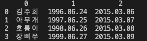
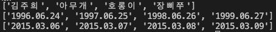

# PROJECT-12. 엑셀의 정보를 불러와 수료증 자동 생성
엑셀에 저장된 수료 명단 정보를 불러와 워드로 수료증을 자동 생성하고 PDF로 변환하는 프로그램을 만든다.

* * *

## Result
### main-1. 데이터를 엑셀로 저장
   
### main-2. 데이터 정보 리스트로 만들어 출력
   

* * *

## Issues

> ### Issue-1. ModuleNotFoundError: No module named 'openpyxl'
> - openpyxl 라이브러리가 설치되지 않아 발생한 에러이다. 맨 아래의 "*ModuleNotFoundError: No module named 'openpyxl'*" 를 확인한다.
> - pip3 install openpyxl
> ```bash
> Traceback (most recent call last):
>   File "/Users/jhkim/learning/my-github/Group_Study/Python/PROJECT12/main-1.py", line 11, in <module>
>     df.to_excel(r'12. 엑셀의 정보를 불러와 수료증 자동 생성\수료증명단.xlsx', index=False, header=False)
>   File "/usr/local/lib/python3.11/site-packages/pandas/util/_decorators.py", line 333, in wrapper
>     return func(*args, **kwargs)
>            ^^^^^^^^^^^^^^^^^^^^^
>   File "/usr/local/lib/python3.11/site-packages/pandas/core/generic.py", line 2414, in to_excel
>     formatter.write(
>   File "/usr/local/lib/python3.11/site-packages/pandas/io/formats/excel.py", line 943, in write
>     writer = ExcelWriter(
>              ^^^^^^^^^^^^
>   File "/usr/local/lib/python3.11/site-packages/pandas/io/excel/_openpyxl.py", line 57, in __init__
>     from openpyxl.workbook import Workbook
> ModuleNotFoundError: No module named 'openpyxl'
> ```